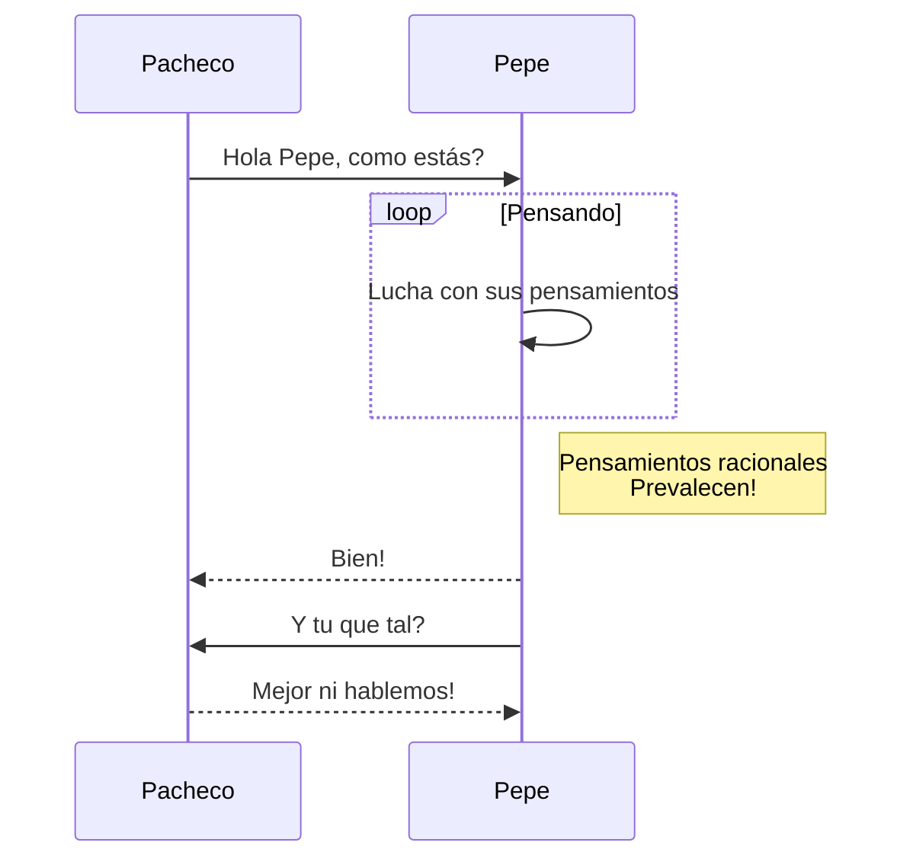

# DIAGRAMAS

### EJERCICIO DE DIAGRAMAS CON MERMAID

### DIAGRAMAS DEL EJERCICIO CAJERO AUTOMÁTICO

##### DIAGRAMA DE FLUJO

Para realizar un **diagrama** emplearemos * *mermaid* *.
La documentación de mermaid se encuentra en el siguiente [enlace](https://mermaid-js.github.io/mermaid/#/).

##### Requisitos:

- [X] Tener una cuenta de GitHub
- [ ] Emplear un editor de textos


```
#####DIAGRAMA DE CLASES
```


