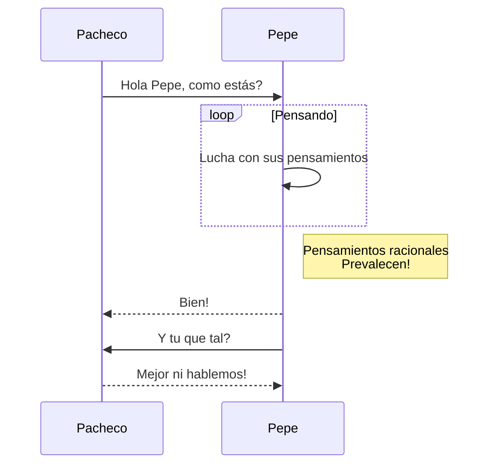

# DIAGRAMAS

### EJERCICIO DE DIAGRAMAS CON MERMAID

### DIAGRAMAS DEL EJERCICIO CAJERO AUTOMÁTICO

##### DIAGRAMA DE FLUJO

```mermaid
graph TD;
    Pedimos cantidad-->Cantidad aceptada;
    Pedimos cantidad-->Error;
    Error-->Pedimos cantidad;
    Cantidad aceptada-->Superior a 500;
```
##### DIAGRAMA DE CLASES


