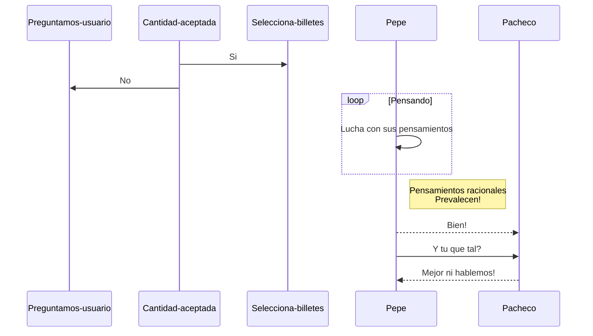
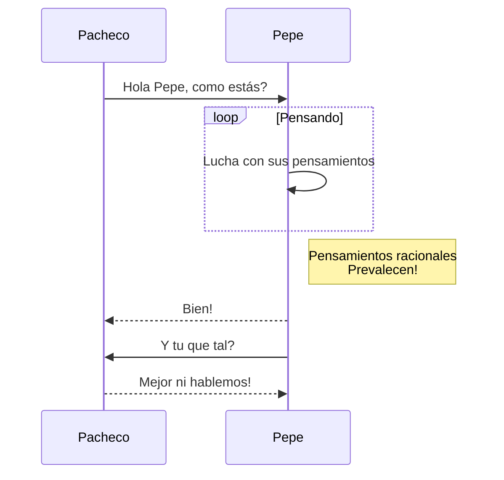

# DIAGRAMAS

### EJERCICIO DE DIAGRAMAS CON MERMAID

### DIAGRAMAS DEL EJERCICIO CAJERO AUTOMÁTICO

##### DIAGRAMA DE FLUJO

```mermaid
sequenceDiagram
    participant Preguntamos-usuario
    participant Cantidad-aceptada
    participant Selecciona-billetes
    Cantidad-aceptada->>Selecciona-billetes: Si
    Cantidad-aceptada->>Preguntamos-usuario: No
    loop Pensando
        Pepe->>Pepe: Lucha con sus pensamientos
    end
    Note right of Pepe: Pensamientos racionales <br/>Prevalecen!
    Pepe-->>Pacheco: Bien!
    Pepe->>Pacheco: Y tu que tal?
    Pacheco-->>Pepe: Mejor ni hablemos!
```
##### DIAGRAMA DE CLASES

```mermaid
sequenceDiagram
    participant Pacheco
    participant Pepe
    Pacheco->>Pepe: Hola Pepe, como estás?
    loop Pensando
        Pepe->>Pepe: Lucha con sus pensamientos
    end
    Note right of Pepe: Pensamientos racionales <br/>Prevalecen!
    Pepe-->>Pacheco: Bien!
    Pepe->>Pacheco: Y tu que tal?
    Pacheco-->>Pepe: Mejor ni hablemos!
```
